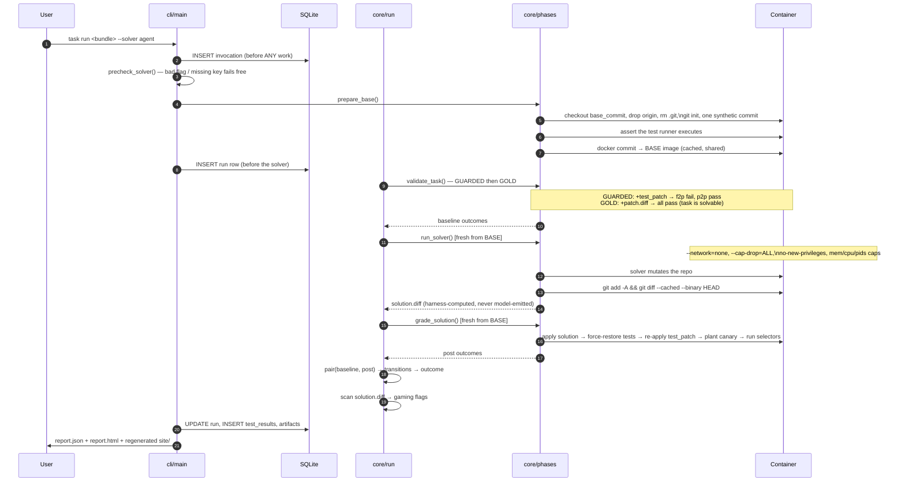
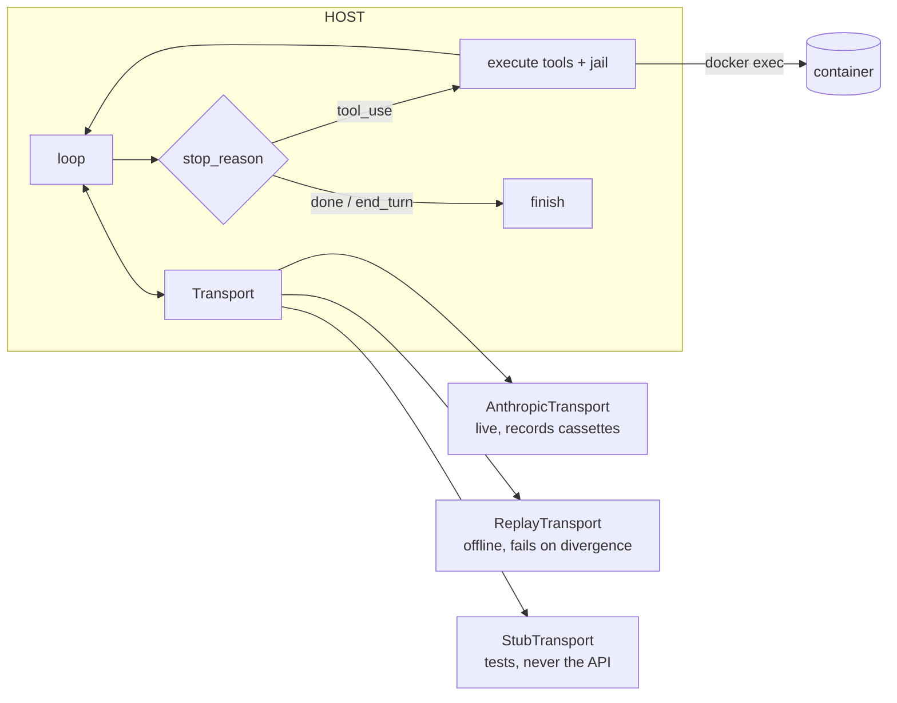

# Architecture — how it works end to end

A component-level walkthrough of a `task run`: what each layer does and where
each guarantee is enforced. For the *why* behind the tradeoffs see
[`DESIGN.md`](DESIGN.md); for usage see [`README.md`](README.md).

---

## 1. The layers

```
src/harness/
  cli/        Typer commands, Rich rendering, the error boundary
  core/       phase machine, grading, classification, models, errors — NO docker imports
  runtime/    ContainerRuntime protocol impls: DockerRuntime (subprocess argv), FakeRuntime
  adapters/   pytest (full); go/jest stubs behind one TestAdapter protocol
  solvers/    gold · noop · agent · replay · cmd — one Solver protocol
  store/      schema.sql + plain-SQL queries (SQLite)
  report/     report.json (Pydantic) + Jinja2 static HTML
  importers/  swebench_pro (HF dataset → bundle)
```

The load-bearing rule: **`core/` imports nothing from `runtime/`.** It receives
a `ContainerRuntime` as a parameter. That is what lets the phase machine,
grading, force-restore ordering, and the path jail run against `FakeRuntime` in
milliseconds with no Docker daemon — the entire correctness core is unit-tested
without a container.

```
cli ──> core ──> (ContainerRuntime protocol)
                        │
             ┌──────────┴──────────┐
        DockerRuntime          FakeRuntime
        (real, subprocess)     (in-memory, tests)
```

## 2. A full `task run`, step by step



The two invariants a reader should carry away: **baseline validation is inside
`run` (step 9), not optional**, and **both SOLVE and SCORED start fresh from
BASE (steps 12, 16)** — the solution diff is the only thing that crosses between
them.

## 3. BASE preparation (the reproducibility + isolation root)

`prepare_base` turns a source image into a clean, snapshot-committed BASE:

1. Resolve the image (pull a pinned `image`, `build` a Dockerfile, or install a
   `recipe`) and, when `repo` is set, `git clone` it.
2. Check out `base_commit` detached, remove the `origin` remote.
3. `rm -rf .git` and re-init as **one synthetic root commit** (fixed author +
   date, so the tree hashes reproducibly). This truncates history — the commits
   after `base_commit` contain the fix — and normalizes whatever state a
   prebuilt image shipped with.
4. Assert the test runner actually executes (fails here with a clear message,
   not at grading time).
5. `docker commit` → `harness/<task_id>:base-<cache_key>`.

The **cache key** = hash(image digest + repo + base_commit + install cmds +
platform + harness env-setup version). It deliberately excludes the problem
statement and test patch, so editing a prompt never forces a rebuild, and
includes the harness version, so setup-logic changes invalidate stale snapshots
instead of silently reusing them. BASE is the only phase that is cached and
shared — it holds no task-specific test material.

## 4. The agent solver



The loop is a manual Messages-API tool loop (not the SDK runner, because every
exchange must be recorded to a cassette). Its prompt is `description.md` plus a
depth-2 file tree — **no selector names, ever**. Six tools exist and nothing
else does. Two checks run on every tool call, host-side:

- **Path jail** — every path is `realpath`-resolved *inside the container* and
  must land under the repo root; writes to guardrail test paths are refused.
- **Selector refusal** — `run_tests` refuses any selector naming a graded test,
  logging the refusal as an event.

Ceilings (`--max-turns`, `--max-cost-usd`, a wall clock of `timeout_s × 4`) end
the solve; grading proceeds on whatever diff exists. Every exchange is written
to `runs/<id>/llm/NNN.json`; `--solver replay:<id>` replays them and **fails
loudly on divergence** (the request fingerprint — model, system text, tool
names, message shapes — must match), so a recorded run re-grades forever at zero
API cost.

**Cost** is summed across turns from the token counts each response reports —
input, output, and cache read/write, each at the model's published
per-million-token list price (cache writes ×1.25, cache reads ×0.10). It is an
*estimate* for the report, the UI, and the `--max-cost-usd` ceiling, not a
billing figure; an unrecognized model contributes $0 rather than erroring. This
is why moving the prompt-cache breakpoint to the end of the conversation cut the
cost of a multi-turn run sharply — most input tokens became cache reads.

## 5. Storage and artifacts

SQLite (`harness.db`, one idempotent `schema.sql`, no ORM). Six tables:

| table | holds |
|---|---|
| `invocations` | every CLI call — written *before* work, updated on exit, so a crash still leaves a row |
| `tasks` | one row per task_id seen |
| `runs` | run_id (ULID), bundle/image digests, cache key, solver, outcome, flags, timings, cost |
| `test_results` | one row per (run, phase, test) — baseline and post |
| `events` | agent turns + notable harness events, in order |
| `artifacts` | kind, path, sha256 |

On disk per run: `runs/<id>/` → `report.json` (the committed deliverable),
`solution.diff`, `pre/` + `post/` (junit XML + stdout/stderr), `llm/` cassettes,
`report.html`. `task ui` renders self-contained static HTML from SQLite —
`index.html` (runs table) and `run-<id>.html` (outcome banner, per-test
transition table, agent timeline with expandable tool calls, the diff, per-phase
logs). No server, no JS build; double-click a file.

## 6. Trust boundaries (summary)

| boundary | mechanism |
|---|---|
| solver ↔ hidden tests | test_patch never applied in SOLVE; history truncated; force-restore at grading |
| solver ↔ network | `--network=none` |
| solver ↔ host | agent runs on host, code in container, `docker exec` between; no host shell ever sees model input (argv lists, `shell=False`) |
| solver ↔ grading result | canary + exit-code cross-check + gaming flags (see DESIGN §2) |
| grading ↔ environment failure | `timeout`/`infra_error` → `inconclusive`, never `unresolved` |

Full threat model and the honest limits are in [`DESIGN.md`](DESIGN.md).
