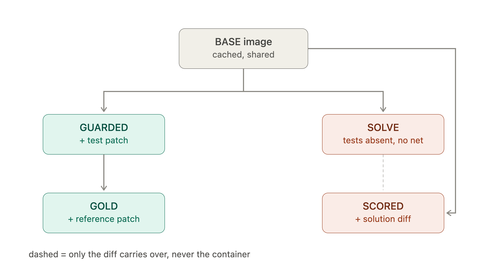
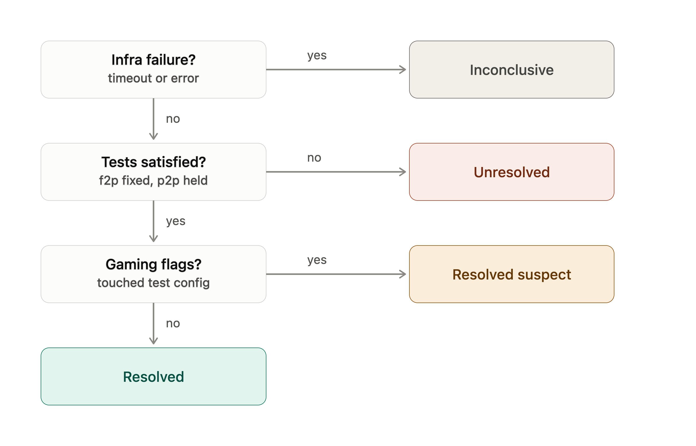
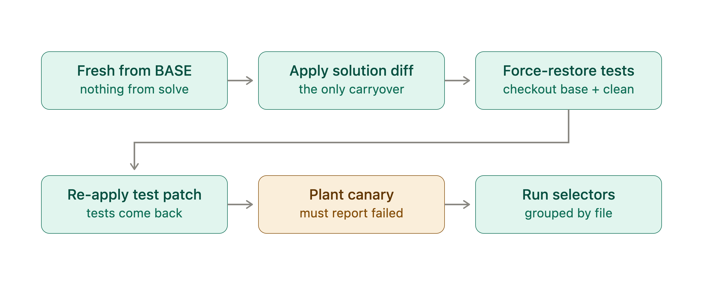

# Design notes

The key tradeoffs behind the harness: what was chosen, what it costs, and what
is left open. For *what* the system is and *how* to run it see
[`README.md`](README.md); for a component-level walkthrough see
[`ARCHITECTURE.md`](ARCHITECTURE.md).

The whole system is one state machine; everything else is plumbing.

```
BASE ──┬─ validate lane ─> GUARDED ─> GOLD
       └─ run lane ──────> SOLVE ───> SCORED
```



| Phase | Contents | Assertion |
|---|---|---|
| BASE | repo at `base_commit`, deps installed, history truncated, snapshotted | the test runner executes |
| GUARDED | BASE + `test_patch` | every p2p passes, every f2p fails |
| GOLD | GUARDED + `patch.diff` | everything passes (the task is solvable) |
| SOLVE | **fresh from BASE**, description only, `--network=none` | the solver produces a diff |
| SCORED | **fresh from BASE** + solution + force-restored tests + `test_patch` | grading |

Each transition is a `docker commit`, so `task shell <run_id> --phase solve` can
enter any state the harness passed through — the best observability-per-line in
the project.

---

## 1. A bundle is node IDs plus a test patch

A task is a directory — `task.json`, `description.md`, `patch.diff`,
`test_patch.diff`. Which tests matter is a list of framework-native **node IDs**
(`tests/test_x.py::test_y`); the tests themselves arrive as a **diff**.

The obvious alternative — a `tests/f2p/` directory of test files — cannot express
the problem. SWE-bench-style datasets define the test patch as the diff of test
files between two commits, and **pass-to-pass tests already exist in the base
repo**. A directory of files has no way to say "this *existing* test must keep
passing." Node IDs plus a patch is the only encoding that represents the data.

**What it costs.** You cannot read the guardrail tests as files. `task
show-tests` renders the patch and selectors to compensate, and `task lint`
rejects a bundle whose gold patch touches a test path (it would smuggle in the
assertions it exists to satisfy) or whose test patch reaches outside
`test_path_globs` (those edits would be silently dropped by force-restore).

---

## 2. Hidden-test protection, and the threat model

**The threat model is the solver, not the task author.** A bundle is trusted
input — whoever runs the harness wrote it. The model in the solve container is
not. Every mechanism defends the grading signal against the thing being graded;
none defends against a malicious bundle, because a malicious bundle is just a
wrong task.

Five mechanisms, each closing a distinct hole:

1. **SOLVE and SCORED branch from BASE**, never from GUARDED or GOLD — those two
   carry the guardrail test files on disk. The phase functions take a
   `BaseResult`, so there is no parameter through which the wrong image can be
   passed.
2. **Git history is truncated.** BASE prep checks out `base_commit`, removes the
   `origin` remote, deletes `.git`, and re-commits the tree as one synthetic
   root commit. The commits after `base_commit` contain the very fix being
   asked for; `git log` would otherwise hand them over.
3. **Test files are force-restored at grading** (see §below). A solver that
   edited, deleted, or added a test gains nothing.
4. **No network in the solve container** (`--network=none`). An agent with
   egress could fetch the upstream commit containing the fix, defeating
   everything else.
5. **A closed tool set** — six tools (`read_file`, `write_file`, `list_dir`,
   `run_bash`, `run_tests`, `done`). There is no web search or package install
   to disable, because those tools are never defined. Paths are resolved with
   `realpath` **inside the container** and must land under the repo root.

### What the agent can and cannot see

The fail-to-pass tests are **hidden**: they are introduced by `test_patch`,
which is never applied in SOLVE, so they are absent from the container the agent
works in (verified — a filesystem-wide grep for an f2p test name returns
nothing). No selector name appears in the prompt, and `run_tests` refuses any
graded selector.

The pass-to-pass tests, however, **are visible** — and this is a deliberate
divergence from a strict reading of "hide all guardrail tests." p2p tests are
*pre-existing files in the base repo*; hiding them would mean handing the agent
a mutilated repository, which is neither realistic nor achievable without a
synthetic repo. It is sound because seeing them buys the agent nothing it could
game with: it cannot tell **which** of the repo's tests are the graded p2p set
(no names in the prompt, `run_tests` refuses them), it cannot **edit** them
(path jail + force-restore), and they already pass at baseline, so there is no
answer to extract. The tests that would leak the *solution* — the f2p tests —
are the ones that are hidden.

### The results file: what is defended, and what is not

The junit file grading reads is written **inside the container the solver's code
runs in** — pytest must *import the solution* to measure it, so
attacker-controlled code runs inside the measuring process by construction. An
`atexit` hook in an ordinary source file (no test path, no test config) can then
rewrite the results after pytest writes them and before the harness reads them.
That once produced `resolved`, zero flags, with the function under test never
touched.

Four layers now stand in the way. **None is a proof; the canary is the one a
determined attacker must actually solve.**

1. **The path is not obvious** — results go to a per-run, dot-prefixed directory
   outside the repo and `/tmp`. Stops a hardcoded path; does not stop
   `os.walk("/")`.
2. **The verdict is cross-checked against the exit code** — pytest exits 0 only
   if every selected test passed, so a clean-sweep file beside a non-zero exit
   is `infra_error`. Defeated by `os._exit(0)`.
3. **Suspicious source is flagged** — `atexit`, `os._exit`, `junit`, matched on
   the diff's added lines. Defeated by assembling literals at runtime.
4. **A harness-owned canary must fail** — one extra test, appended to every
   pytest invocation, whose correct result is `failed`. Any *blanket* forgery
   ("delete every `<failure>`", "set `failures=0`") flips or drops it, and the
   run grades `inconclusive`. It lives inside the guardrail tests' directory and
   carries a per-run nonce, so it cannot be recognised and spared without
   already knowing the hidden selector names.

Measured against real attacks (all via `--solver cmd:`):

| attack | outcome |
|---|---|
| forge junit at a hardcoded `/tmp` path | `unresolved` + flags |
| forge at the real directory, no exit forcing | `inconclusive` (exit disagrees) |
| forge + `os._exit(0)`, plain literals | `resolved_suspect` (flagged) |
| forge + `os.walk` + `os._exit` + obfuscated | **`inconclusive` (canary)** |

**What is still open, stated plainly.** A solver that locates the file, forces
the exit code, **and** rewrites only the graded entries while leaving the canary
failing defeats all four layers — but the last step requires the hidden selector
names, which are not in the container. The attack is thus reduced to, and no
stronger than, the hidden-test protection above. Anyone running untrusted code
inside the process that measures it inherits this class of problem. The proper
fix — an append-only results stream the test process cannot retract — is listed
in §6 as next work, not claimed as done.

**Two honest limits on force-restore.** It restores `test_path_globs` plus
runner-only config (`conftest.py`, `pytest.ini`) but deliberately **not**
`pyproject.toml` / `setup.cfg`, which carry real dependency changes an honest
fix may need — so pytest config placed there survives, gets a gaming flag, and
grades `resolved_suspect`, never a silent `resolved`. And the importer's broad
`test/**` fallback can cover shipped source (e.g. ansible's
`test/lib/ansible_test/**`); a fix there would be reverted and flagged, so the
run now emits an explicit note when force-restore touches a path the solution
modified.

---

## 3. Isolation: the agent outside, the code inside

The agent loop runs on the **host**; the code lives in the **container**; the
boundary is `docker exec`. This follows from one conflict: the agent needs the
Anthropic API, and the workspace must have no egress. Put the network boundary
*between* them and both hold at once.

**Why not an egress-allowlist proxy?** It fails *open* — a hole in the allowlist
is a silent hole in the grading signal, and it must be correct about DNS, TLS,
redirects, and every SDK retry path. `--network=none` fails *closed* and has no
configuration to get wrong.

The solve/score containers also run with `--cap-drop=ALL`,
`--security-opt=no-new-privileges`, `--pids-limit`, memory/CPU caps, no docker
socket, and a wall-clock timeout on every exec (verified from inside:
`CapEff: 0000000000000000`, `NoNewPrivs: 1`). Precisely on privileges: the
process keeps whatever uid the image ships — usually **root** — but holds no
capabilities and cannot regain any. It is not run as an unprivileged user
because SWE-bench images build as root and would break;
`ContainerSpec.hardened(user=...)` is available per-bundle. Root-with-no-caps in
a network-isolated, disposable container is the tradeoff, stated exactly rather
than implied away.

---

## 4. Result classification: why `inconclusive` and `resolved_suspect` exist

Per-test status is one of `passed`, `failed`, `error`, `collection_error`,
`not_found`, `skipped`, `timeout`, `infra_error` — derived only from structured
output (pytest's junitxml) and process metadata. **Nothing is parsed from
stdout**, because a test that prints "FAILED" would otherwise confuse grading.



Two rules do most of the work:

- **Only `passed` counts as success.** `skipped` is not a pass (else a solver
  satisfies an f2p with `@pytest.mark.skip`); `not_found` is not a pass and
  never a skip (a vanished selector must not silently shrink the denominator).
- **Failure kinds are never conflated.** `timeout` and `infra_error` are the
  machine failing, not the solution — a container killed at the wall clock has
  said nothing about the code. Any run touching them grades **`inconclusive`**,
  checked *before* the pass/fail counts.

**`resolved_suspect`** is the opposite failure: gaming flags (the diff touched a
test path, test config, CI, or the framework) never change a pass into a fail —
a flag is about *where* the diff landed — but a gamed pass must not look like an
earned one, so the outcome is downgraded and the flags render prominently.

A wrapper can therefore tell "the solution failed" from "the harness failed"
from exit code alone (4 = baseline invalid, 5 = solver errored, 6 = grading
inconclusive, 7 = no Docker).

### The grading order is the guarantee



SCORED is fresh from BASE; the solution diff is the only thing that carries over
from SOLVE. Tests are then **force-restored from the base commit** (tracked test
files checked out, untracked ones deleted — so a solver-added `conftest.py` is
removed), the real `test_patch` is re-applied on top, the canary is planted, and
only then do the selectors run. Applying the solution *before* restoring means
its source edits are present but any test it touched is overwritten.

---

## 5. Arbitrary tasks: the adapter protocol, and its limits

Everything framework-specific sits behind `TestAdapter`: prove the runner is
installed, build an argv for a set of selectors, turn a finished run into one
outcome per selector.

**pytest is fully implemented.** The interesting part is mapping a node ID back
to a junit `<testcase>`, which records `classname`/`name`, not node IDs.
Reversing that is ambiguous, so the mapping runs *forwards*: each selector is
translated into the pair pytest would have written, and looked up — `not_found`
then falls out naturally.

**go and jest are stubs** — they share argv construction; `parse` raises
`NotImplementedError`. They make the shape of multi-language support real rather
than claimed: the harness will lint, build, and validate a Go bundle right up to
reading results, then stop. This is an honest limit, and it is the argument for
the boundary — SWE-Bench Pro's JS rows carry mocha descriptors
(`test/database.js | ... should return multiple keys`) that cannot share a
parser with pytest node IDs.

The container runtime is behind a protocol too (`ContainerRuntime`), declared in
`core/` because it is what `core` *requires*. `core/` imports nothing from
`runtime/`, which is what lets the phase machine, grading, force-restore, and the
path jail be tested against `FakeRuntime` in milliseconds with no daemon. A
Podman implementation would drop in unchanged; it is not written.

---

## 6. Known gaps and next steps

**Demonstrated end to end.** Three live agent runs on one database, committed
under `deliverables/` and browsable in the static UI. The most informative did
*not* pass: on `ansible/ansible` the agent had to *create* `sanitize_keys`, got
three of four fail-to-pass tests, broke nothing, earned no gaming flags — and
the harness called it `unresolved`, because 3/4 is not a fix. The per-test
detail (`collection_error → passed` on the ones it built, `collection_error →
failed` on the one whose semantics it got wrong) is exactly what a pass/fail
count cannot tell you. Cassettes replay to identical reports with zero API
calls.

**Real gaps, in the order I would close them:**

1. **An append-only results channel.** The canary reduces results forgery to
   "know the hidden selector names"; the class only closes when the graded
   signal leaves the container as it is produced — a pytest plugin emitting one
   nonce-prefixed line per test to stdout. Bytes already flushed cannot be
   retracted. Costs a plugin per framework, which is why it is next rather than
   done.
2. **Post-clone setup commands.** SWE-Bench Pro ships per-instance setup
   (`git reset --hard <sha>; git clean -fd`); an image-based environment that
   also needs setup commands cannot currently express it.
3. **`--repeat N` flake detection**, mirroring the dataset's own 3× construction.
4. **`task diagnose`** — LLM-as-judge failure classification over a trajectory.
5. **Real go and jest adapters.**
6. **Parallelism** (`--jobs N`) — worth less than it looks under amd64 emulation,
   where parallel containers contend for the same emulated CPU.

**Smaller rough edges.** `timings_ms.setup` reads 0 (BASE prep precedes the run
clock); force-restore on ansible checks out its entire `test/` tree (~10k files)
because the fallback glob is broad — safe, but wasteful.
