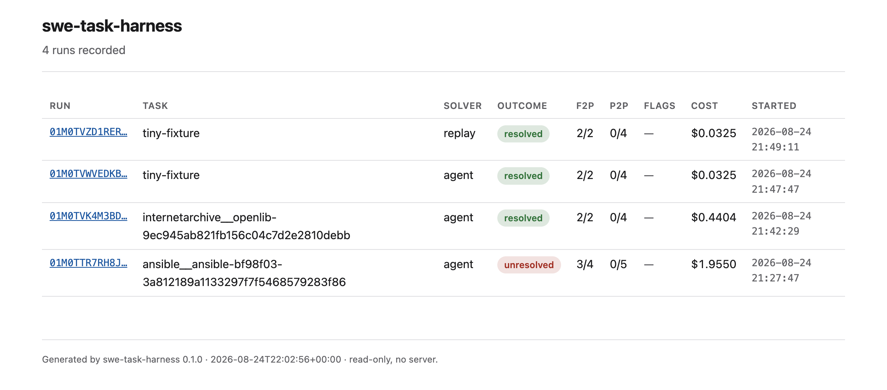
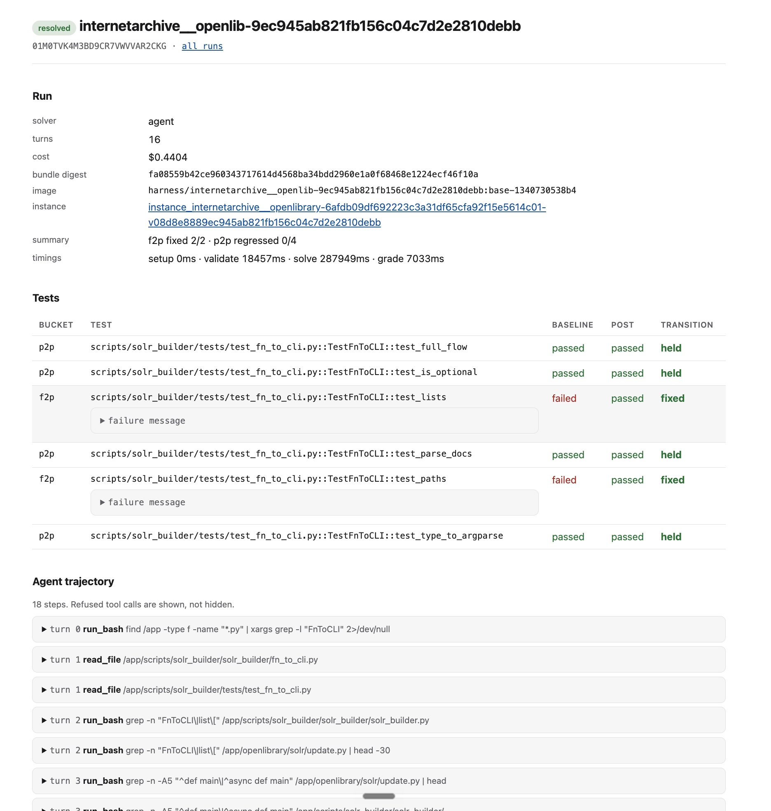

# swe-task-harness

A CLI that packages SWE-bench-style coding tasks into Docker containers,
validates them, runs an LLM coding agent against them in isolation, grades the
result, and records everything to SQLite with a browsable static-HTML viewer.

Jump to [setup & requirements](#setup--requirements) if you just want to run it.

---

## What it is

Engineers who author coding-benchmark tasks need to see how a frontier LLM does
on a task without hand-rolling the container plumbing each time. A task here is a
**bundle**: a repository snapshot, a problem statement, a reference patch, and
guardrail tests (fail-to-pass + pass-to-pass). The harness:

- **packages** the repo in a container at a commit and proves it is built
  correctly (dependencies present, tests executable);
- **validates** the baseline — before any solver runs, every pass-to-pass test
  must pass and every fail-to-pass test must fail, and the reference patch must
  make them all pass (proving the task is solvable);
- **runs a solver** (an LLM agent, or a stub) in a network-isolated container
  that never sees the guardrail tests, then grades its diff against those tests;
- **records** each run under a queryable id — which tests passed, which failed,
  the agent's full trajectory, timings, and cost.

## How it works (in one picture)

The whole system is one state machine:

```
BASE ──┬─ validate lane ─> GUARDED ─> GOLD
       └─ run lane ──────> SOLVE ───> SCORED
```

BASE is the repo at its base commit with history truncated. The **validate
lane** adds the tests (GUARDED) then the reference patch (GOLD) to check the task
is well-formed. The **run lane** branches a fresh container from BASE, lets the
solver work with no network and no access to the tests (SOLVE), then grades in
another fresh-from-BASE container where the tests are force-restored and
re-applied (SCORED). The solver's diff is the only thing that crosses between
the two — it never sees the hidden tests, the git history, or the network.

See **[ARCHITECTURE.md](ARCHITECTURE.md)** for the component walkthrough and
**[DESIGN.md](DESIGN.md)** for the tradeoffs and threat model.

## What is out of scope

Stated up front so the boundaries are clear:

- **Building instance environments from scratch.** SWE-Bench Pro ships a
  prebuilt image per instance; the harness prefers it and does not reconstruct
  dependency stacks.
- **Test frameworks other than pytest are stubs.** go and jest sit behind the
  same adapter protocol (they lint, build, and validate) but do not yet parse
  results.
- **Parallelism / queues.** One task at a time; no `--jobs N`.
- **Multiple model providers.** Anthropic Messages API only.
- **A server or write-capable UI.** The UI is read-only static HTML.
- **Flake detection (`--repeat N`), `task diagnose`, `task compare`** — noted as
  next steps in DESIGN §6, not implemented.

---

## Commands

Every command writes an invocation row to the database before it does any work,
so even a crash leaves a record. Run `uv run task <cmd> --help` for full flags.

| Command | What it does |
|---|---|
| `task doctor [--check-api]` | Preflight: Docker, disk, architecture, credentials. `--check-api` verifies the Anthropic key with a call that bills nothing. |
| `task lint <bundle>` | Validate a bundle's schema and structure — no Docker. |
| `task init <bundle>` | Build the environment and snapshot the BASE phase. |
| `task validate <bundle>` | Assert GUARDED and GOLD hold (p2p pass, f2p fail, then all pass under the reference patch). |
| `task run <bundle> --solver X` | Validate the baseline, run a solver, grade, write a report. The main command. |
| `task runs [--task X] [--outcome Y]` | List recorded runs. |
| `task log <id>` | Show a stored invocation or run with its logs / agent trajectory. |
| `task report <run_id> [--format json\|html]` | Print the stored report for a run. |
| `task ui [--out dir]` | Regenerate the static HTML index + run pages. |
| `task shell <run_id> --phase <p>` | Open a shell inside any recorded phase snapshot (`base\|guarded\|gold\|solve\|scored`). |
| `task show-tests <bundle>` | Render a bundle's test patch + selectors (authoring aid — the tests are stored as a diff). |
| `task import --instance-id X` | Convert a SWE-Bench Pro instance into a bundle. `--survey N` ranks candidates by size. |
| `task gc [--days N]` | Remove old phase snapshots. |

### The core loop (zero API calls)

```bash
uv run task lint     examples/tiny-fixture              # schema + structure
uv run task validate examples/tiny-fixture              # p2p pass, f2p fail, gold fixes
uv run task run      examples/tiny-fixture --solver gold   # must grade `resolved`
uv run task run      examples/tiny-fixture --solver noop   # must grade `unresolved`
uv run task runs                                        # list what ran
```

`gold` and `noop` are the harness's own regression suite: `gold` applies the
reference patch and must resolve; `noop` changes nothing and must leave every
fail-to-pass test failing. Neither calls an API.

### Solvers

| `--solver` | Behaviour |
|---|---|
| `gold` | Applies the reference patch. Must grade `resolved`. |
| `noop` | Changes nothing. Must grade `unresolved`. |
| `agent` | The LLM loop (Anthropic Messages API, `claude-sonnet-4-6` default; `--model`, `--max-turns`, `--max-cost-usd`). |
| `replay:<run_id>` | Replays a recorded agent run from its cassettes — offline, free, fails loudly if the prompt/tools changed. |
| `cmd:<shell command>` | Runs an arbitrary command in the solve container as the solver (wire in an external agent, or try a fix by hand). |

### Running an agent

```bash
uv run task doctor --check-api                          # verify the key; bills nothing
uv run task run examples/tiny-fixture --solver agent --max-turns 80
uv run task run examples/tiny-fixture --solver replay:<run_id>   # reproduce offline, free
```

Every API exchange is recorded to `runs/<id>/llm/NNN.json`. The workspace has no
network; the agent runs on the host and reaches the code through `docker exec`.

### Inspecting a run

```bash
uv run task runs                                 # ids + outcomes
uv run task report <run_id>                      # the JSON evaluation artifact
uv run task log    <run_id>                      # the agent's step-by-step trajectory
uv run task shell  <run_id> --phase solve        # a shell inside that snapshot
```

## The UI

```bash
uv run task ui && open site/index.html
```

`task ui` renders **self-contained** HTML from the database — no server, no
build step, no external assets. It is regenerated automatically after every
`task run`; double-click a file to view it anywhere.

**The runs index** (`index.html`) — outcome badge, task, solver, f2p/p2p counts,
gaming flags, and cost:



**A single run** (`run-<id>.html`) — run metadata (digests, image, timings), a
per-test transition table with expandable failure messages, the agent step
timeline with expandable tool calls, the solution diff, and per-phase logs:



## Exit codes

Distinct codes let a wrapper tell failure kinds apart without parsing output:

| Code | Meaning |
|---|---|
| 0 | ok — including `unresolved`, which is a result, not an error |
| 1 | unexpected error |
| 2 | usage error |
| 3 | bundle invalid |
| 4 | baseline validation failed — the *bundle* is wrong |
| 5 | solver failed |
| 6 | inconclusive — the *machine* failed, not the solution (artifacts still written) |
| 7 | Docker unavailable |

---

## Setup & requirements

### Prerequisites

- **Docker** — the daemon must be running. Install [Docker
  Desktop](https://www.docker.com/products/docker-desktop/) (macOS/Windows) or
  the engine (`sudo apt-get install docker.io` on Debian/Ubuntu, then
  `sudo systemctl start docker`). Verify with `docker version`.
  - On **Apple Silicon**, SWE-Bench Pro images are amd64 and run under emulation
    (several times slower). `task doctor` warns when emulating. The tiny fixture
    builds natively.
- **[uv](https://docs.astral.sh/uv/)** — the Python toolchain/runner. Install
  with `curl -LsSf https://astral.sh/uv/install.sh | sh` (it manages the Python
  3.11+ interpreter for you; no separate Python install needed).
- **Disk** — ~20 GB free for instance images and per-phase snapshots.
- **An Anthropic API key** — only for `--solver agent`. The `gold`, `noop`, and
  `replay` solvers need none.

### Install

```bash
git clone <repo> && cd swe-task-harness
uv sync                          # create the venv and install dependencies
uv run task doctor               # confirm Docker, disk, architecture
```

### Configure the API key (only for the agent solver)

```bash
cp .env.example .env             # then paste ANTHROPIC_API_KEY=sk-ant-... into it
uv run task doctor --check-api   # verifies the key works; bills nothing
```

The key is read from `.env` or the environment; it is never written to the
container or to any cassette. `.env`, `runs/`, and `harness.db` are gitignored.

### A real SWE-Bench Pro instance

```bash
uv run task import --survey 200 --language python       # rank candidates by size
uv run task import --instance-id instance_ansible__ansible-bf98f03...
uv run task validate examples/swebench-pro/<task>       # optional: prove it's well-formed
uv run task run      examples/swebench-pro/<task> --solver agent --max-turns 80
```

### Tests

```bash
uv run pytest              # unit suite, no Docker, ~4s
uv run pytest -m docker    # integration: real containers
```

The unit suite is hermetic by construction — any unmarked test that reaches the
Docker daemon fails with an assertion. No test ever calls the Anthropic API.

---

## Layout

```
src/harness/
  cli/        Typer commands, Rich rendering, error boundary
  core/       phase machine, grading, classification, models — NO docker imports
  runtime/    DockerRuntime (subprocess argv) and FakeRuntime
  adapters/   pytest (full); go/jest stubs behind the same protocol
  solvers/    gold, noop, agent, replay, cmd — one Solver protocol
  store/      schema.sql + queries
  report/     json + jinja2 html
  importers/  swebench_pro
examples/     tiny-fixture (offline) + imported SWE-Bench Pro bundles
deliverables/ the assignment deliverables: index, evaluation artifacts, design notes
```

**[DESIGN.md](DESIGN.md)** — tradeoffs, threat model, known gaps ·
**[ARCHITECTURE.md](ARCHITECTURE.md)** — end-to-end mechanism ·
**[deliverables/](deliverables/)** — the committed evaluation runs.
